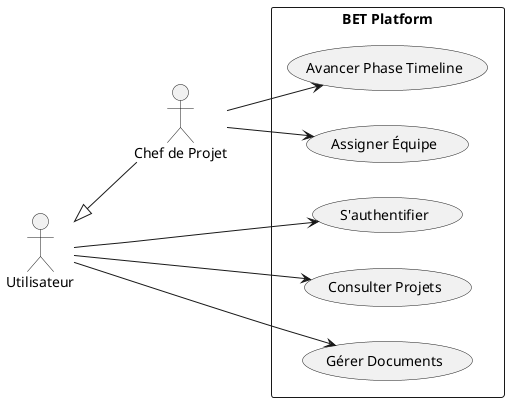
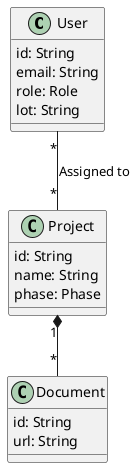

# RAPPORT DE PROJET DE FIN D'ÉTUDES : BET-PLATFORM
## Plateforme Collaborative de Coordination pour Bureau d'Études Techniques

---

## Sommaire
1. [Introduction](#introduction)
2. [Chapitre 1 : Analyse de l'Existant et Besoins](#chapitre-1--analyse-de-lexistant-et-besoins)
3. [Chapitre 2 : Méthodologie Agile Adoptée](#chapitre-2--méthodologie-agile-adoptée)
4. [Chapitre 3 : Analyse et Conception (UML)](#chapitre-3--analyse-et-conception-uml)
5. [Chapitre 4 : Réalisation et Implémentation](#chapitre-4--réalisation-et-implémentation)
6. [Chapitre 5 : Tests, Validation et Déploiement](#chapitre-5--tests-validation-et-déploiement)
7. [Chapitre 6 : Bilan du Projet et Perspectives](#chapitre-6--bilan-du-projet-et-perspectives)
8. [Conclusion Générale](#conclusion-générale)

---

## Introduction
Dans le domaine de l'ingénierie du bâtiment, la coordination entre les différents corps d'état (Lots) est un défi majeur. Les erreurs de communication, les documents obsolètes et le manque de suivi des remarques techniques entraînent souvent des surcoûts et des retards importants. C'est dans ce contexte que s'inscrit le projet **BET-Platform**, une solution logicielle moderne conçue pour centraliser et fluidifier les échanges entre les acteurs d'un projet de construction.

---

## Chapitre 1 : Analyse de l'Existant et Besoins

### 1.1 Système Actuel
Aujourd'hui, la plupart des Bureaux d'Études Techniques (BET) utilisent des outils fragmentés :
- E-mails pour les échanges.
- Excel pour le suivi des remarques et des livrables.
- Portails de transfert de fichiers (WeTransfer, FTP) pour les documents.
- Calendriers partagés pour les réunions.

### 1.2 Limites du Système Actuel
- **Fragmentation de l'information** : Les données sont éparpillées entre plusieurs outils.
- **Risque d'erreurs** : Utilisation de versions obsolètes de plans.
- **Manque de traçabilité** : Difficile de savoir qui a fait quoi et quand.
- **Absence de vision globale** : Le Chef de Projet a du mal à visualiser l'avancement réel en temps réel.

### 1.3 Besoins Identifiés
**Besoins Fonctionnels :**
- Gestion multi-utilisateurs avec rôles spécifiques (Chef de Projet, Référent Lot, Contributeur).
- Création de projets avec suivi par phases (APS, APD, PRO, etc.).
- Gestion de dossiers et documents techniques avec stockage cloud.
- Suivi interactif des remarques techniques et décisions.
- Dashboard de pilotage avec timeline automatisée.

**Besoins Non-Fonctionnels :**
- **Sécurité** : Protection des données et accès sécurisés.
- **Performance** : Temps de réponse rapide pour l'upload/download de documents volumineux.
- **Ergonomie** : Interface intuitive et moderne (UX/UI Premium).
- **Disponibilité** : Système accessible 24/7 via le web.

---

## Chapitre 2 : Méthodologie Agile Adoptée

### 2.1 Choix de la Méthodologie Scrum
Nous avons opté pour le framework **Scrum** afin de diviser le développement en itérations courtes (Sprints), permettant une validation continue et une adaptation rapide aux changements.

### 2.2 Rôles Scrum
- **Product Owner** : Garant de la vision métier et de la priorité des fonctionnalités.
- **Scrum Master** : Facilitateur garant du respect de la méthode Agile.
- **Development Team** : Équipe pluridisciplinaire chargée de réaliser les incréments logiciels.

### 2.3 Artefacts Scrum
- **Product Backlog** : Liste ordonnée de toutes les fonctionnalités souhaitées.
- **Sprint Backlog** : Sélection d'items du backlog à réaliser durant un sprint.
- **Incrément** : Version potentiellement livrable du produit à la fin de chaque sprint.

### 2.4 Événements Scrum & Sprints
Nous avons structuré le projet en **4 Sprints principaux** d'une semaine chacun :
- **Daily Scrum** : Point quotidien sur l'avancement.
- **Sprint Review** : Démonstration des fonctionnalités terminées.
- **Sprint Retrospective** : Analyse des points d'amélioration pour l'itération suivante.

---

## Chapitre 3 : Analyse et Conception (UML)

### 3.1 Diagrammes de Cas d'Utilisation
**Cas d'Utilisation Global :**
- L'administrateur gère les projets et l'équipe.
- Les intervenants consultent et collaborent.

### 3.2 Diagramme de Classes
L'architecture de données repose sur une relation **Many-to-Many** entre Utilisateurs et Projets, permettant d'affecter plusieurs experts à plusieurs chantiers.

---

## Chapitre 4 : Réalisation et Implémentation

### 4.1 Environnement de Développement
- **IDE** : Visual Studio Code.
- **Langage** : JavaScript / TypeScript.
- **Runtime** : Node.js.
- **Gestionnaire de versions** : Git & GitHub.

### 4.2 Architecture du Système
Application Full-Stack basée sur la **Stack T3 modernisée** :
- **Framework** : Next.js 15 (App Router).
- **Base de Données** : PostgreSQL via Supabase.
- **ORM** : Prisma pour la gestion du schéma et des requêtes.
- **Stockage Cloud** : Supabase Storage pour les fichiers binaires.

### 4.3 Fonctionnalités Implémentées

#### 4.3.1 Authentification et Gestion des Utilisateurs
- Intégration de Supabase Auth.
- Connexion via GitHub sécurisée.
- Système de rôles (RBAC) pour restreindre l'accès aux modifications sensibles.

#### 4.3.2 Gestion d'Équipe (Assignation)
- Interface de gestion permettant au Chef de Projet de choisir des experts.
- Mise en œuvre d'une table de jonction `_ProjectAssignments` pour la flexibilité des affectations.

#### 4.3.3 Timeline et Phases du Projet
- Mise en place du cycle de vie standard BET (ESQUISSE -> APS -> APD -> PRO -> DCE...).
- Création d'un **Modal de Confirmation Professionnel** avec animations pour sécuriser le changement de phase.

---

## Chapitre 5 : Tests, Validation et Déploiement

### 5.1 Tests et Validation
- **Tests Unitaires** : Validation des fonctions de calcul de dates et de droits d'accès.
- **Tests API** : Utilisation d'endpoints de diagnostic (ex: `/api/test-assign`) pour vérifier l'intégrité des relations en base de données.
- **Tests UI/UX** : Vérification de la réactivité sur mobile et desktop.

### 5.2 Environnement de Production
- **Hébergement Frontend/API** : Vercel (Déploiement continu depuis la branche `main`).
- **Base de Données Production** : Supabase PostgreSQL (Managed instance).

### 5.3 Stratégie de Déploiement et Documentation
- **CI/CD** : Chaque `git push` déclenche un build et un test automatique.
- **Documentation Techniques** : README complet, documents SETUP pour Supabase et Storage.

---

## Chapitre 6 : Bilan du Projet et Perspectives

### 6.1 Difficultés Rencontrées
- **Synchronisation Prisma** : Gestion des verrous de fichiers sur environnement Windows durant la régénération du client.
- **Relations Many-to-Many** : Complexité de la mise en œuvre initiale dans l'UI sans rafraîchissement global de la page.
- **Supabase Storage** : Configuration des politiques de sécurité (RLS) pour autoriser l'accès aux documents tout en les protégeant.

### 6.2 Compétences Acquises
- Maîtrise des architectures Serverless avec Next.js.
- Compétences avancées en modélisation de bases de données relationnelles (SQL/Prisma).
- Gestion de projet en mode Agile / Sprint.
- Design UX/UI avancé avec CSS Modules et Glassmorphism.

### 6.3 Perspectives d'Évolution
- **Version Mobile Native** : Développement via React Native.
- **Module BIM** : Visualisation de modèles 3D directement dans le navigateur.
- **Notifications Real-time** : Alertes push lors d'un nouveau document ou d'une remarque prioritaire.

---

## Conclusion Générale
Le projet **BET-Platform** répond de manière efficace aux problématiques de coordination des Bureaux d'Études Techniques. En appliquant la méthodologie Scrum, nous avons pu développer une solution robuste, évolutive et centrée sur l'utilisateur. Ce travail constitue une base solide pour la digitalisation complète des processus d'ingénierie dans le secteur du bâtiment.
